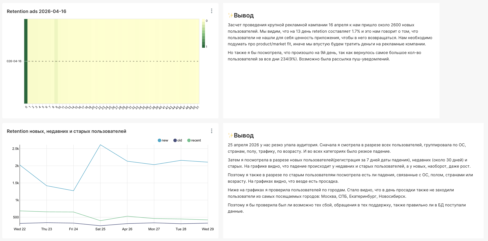
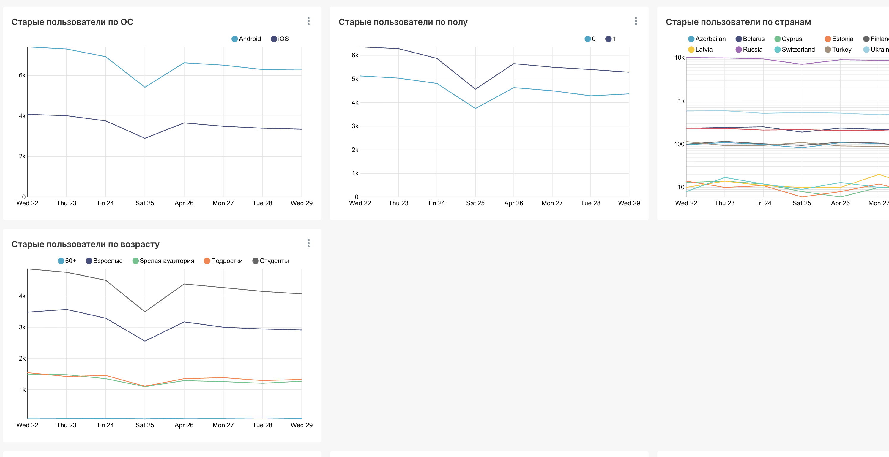
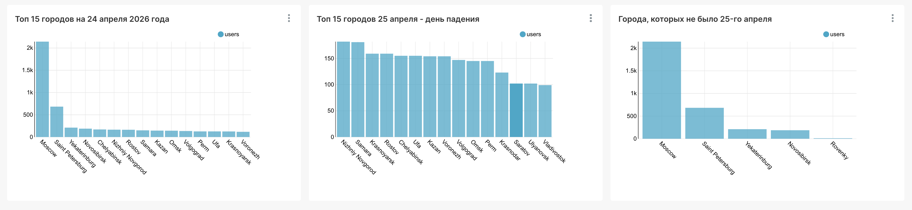

# 📊 Анализ пользовательской активности

## Контекст
Продуктовая команда зафиксировала два события: успешную рекламную кампанию,
которая привела новых пользователей, и резкое падение аудитории в один из дней.
Бизнес поставил задачу разобраться в обоих случаях.

## Задачи

**Задача 1. Оценка качества рекламного трафика**
Рекламная кампания 16 апреля привлекла около 2600 новых пользователей.
Необходимо понять, насколько эта аудитория оказалась лояльной:
как менялся retention по дням и остались ли они в продукте.

**Задача 2. Расследование падения аудитории**
25 апреля DAU резко упал. Необходимо выявить сегмент пользователей,
которые не смогли воспользоваться лентой, и найти общий признак.

## Выводы

**По рекламному трафику**
К 13-му дню retention рекламных пользователей составил 1.7% — аудитория
не нашла ценность в продукте и не возвращается. Рекомендация: пересмотреть
product/market fit до следующей рекламной кампании. Отдельно стоит
исследовать всплеск на 9-й день (9% вернувшихся) — вероятно, сработала
пуш-рассылка.

**По падению аудитории**
Падение 25 апреля затронуло недавних и старых пользователей — у новых,
напротив, наблюдался рост. Просадка зафиксирована во всех срезах: ОС,
пол, возраст, страна. Из крупных городов в этот день не заходили
пользователи из Москвы, Санкт-Петербурга, Екатеринбурга и Новосибирска.
Гипотеза: технический сбой или проблема с поступлением данных в БД.

## Дашборд

### Retention рекламных пользователей и динамика по сегментам

### Сегментация старых пользователей по ОС, полу, странам и возрасту

### Анализ географии в день падения

## Инструменты
`DataLens` `SQL` `ClickHouse`
